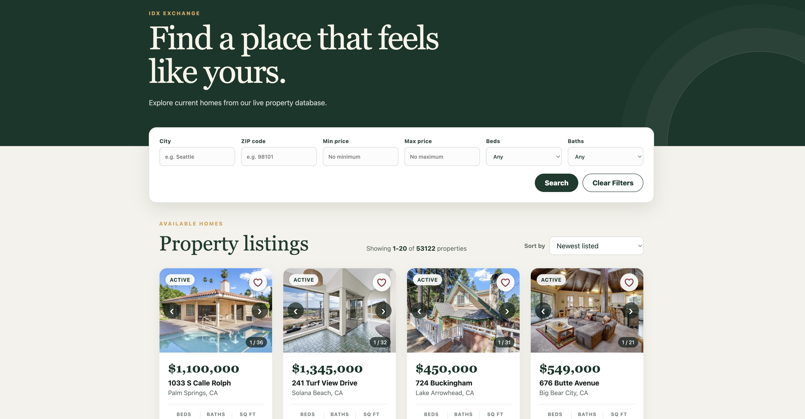

# IDX Exchange

IDX Exchange is a full-stack real-estate listings application. Users can filter and sort homes, page through search results, view listing details and photo galleries, save favorites in the browser, and browse open houses in a calendar. The Express API validates public input and reads MLS-style property data from MySQL/MariaDB.



> The image is a repository-hosted interface preview.

## Tech stack

Versions below are the versions declared by the lockfiles/package manifests.

| Layer | Technology |
| --- | --- |
| Frontend | React 18.3.1, React DOM 18.3.1, React Router 6.30.1, Create React App / react-scripts 5.0.1 |
| Backend | Node.js, Express 5.2.1, CORS 2.8.6, dotenv 17.4.2 |
| Database | MySQL-compatible server; `mysql2` 3.22.5 (the supplied dump originated from MariaDB 10.2.44) |
| Tests | Jest 30, Supertest 7, Testing Library React 16.1.0, jest-dom 6.6.3 |

## Architecture

```text
Browser (React, :3000)
  ├─ pages: listings, property detail, favorites, open-house calendar
  ├─ reusable components and localStorage-backed favorites
  └─ /api requests (CRA development proxy)
             │
Express API (:5001)
  ├─ /api/properties    validation, filters, sorting, pagination
  ├─ /api/openhouses    date range/calendar queries
  └─ mysql2 pool
             │
MySQL/MariaDB: rets_property ← L_ListingID → rets_openhouse
```

The backend uses parameter placeholders for user-provided values. Sort columns are allow-listed because SQL identifiers cannot be parameterized. The frontend treats the API as the source of truth; favorites contain only listing IDs in `localStorage`.

## Fresh-machine setup

### 1. Install prerequisites

- Git
- Node.js 20 LTS or newer and npm
- MySQL 8+ or a compatible MariaDB server

### 2. Clone and install

```bash
git clone <repository-url>
cd IDX_Exchange_SDE_Program
cd backend && npm ci
cd ../frontend && npm ci
cd ..
```

### 3. Create the database

Create an empty database and an application user. Substitute your own secure password:

```sql
CREATE DATABASE idx_exchange CHARACTER SET utf8mb4 COLLATE utf8mb4_unicode_ci;
CREATE USER 'idx_user'@'localhost' IDENTIFIED BY 'replace_with_a_local_password';
GRANT ALL PRIVILEGES ON idx_exchange.* TO 'idx_user'@'localhost';
FLUSH PRIVILEGES;
```

Import the two supplied dumps from the workspace directory that contains this repository:

```bash
mysql -u idx_user -p idx_exchange < ../rets_property.sql
mysql -u idx_user -p idx_exchange < ../rets_openhouse.sql
```

If the dump files were delivered separately, place them beside the `IDX_Exchange_SDE_Program` directory first. The imports create both tables, indexes, and sample records.

### 4. Configure the backend

```bash
cd backend
cp .env.example .env
```

Edit `.env` so `DB_HOST`, `DB_PORT`, `DB_USER`, `DB_PASSWORD`, and `DB_NAME` match the database created above. Do not commit `.env`; it contains local credentials. `HOST` defaults to `127.0.0.1` and `PORT` defaults to `5001`.

Google Maps on the detail page is optional. To enable it, create `frontend/.env.local`:

```dotenv
REACT_APP_GOOGLE_MAPS_API_KEY=your_browser_api_key
```

Restrict that key to the Maps JavaScript API and your local/production origins.

### 5. Run the app

Use two terminals from the repository root:

```bash
# terminal 1
cd backend
npm run dev
```

```bash
# terminal 2
cd frontend
npm start
```

Open `http://localhost:3000`. Confirm the backend and database with `curl http://127.0.0.1:5001/api/health`.

## Commands and testing

```bash
cd backend
npm test
npm run test:coverage

cd ../frontend
npm test -- --watchAll=false
npm test -- --watchAll=false --coverage \
  --collectCoverageFrom='src/components/{PropertyFilters,Pagination,PropertyCard}.js'
npm run build
```

Backend route tests mock `src/db.js`, so they never read or modify a real database. Coverage thresholds enforce at least 70% statements and lines for `src/routes/properties.js`. The focused frontend coverage command measures the three Week 11 critical components.

## API reference

Base URL for local development: `http://127.0.0.1:5001`. All bodies are JSON. Validation failures return `400`, unknown listings return `404`, and unexpected database failures return `500`.

### `GET /`

Service discovery response.

```bash
curl http://127.0.0.1:5001/
```

```json
{"message":"IDX Exchange backend is running","health":"/api/health"}
```

### `GET /api/health`

Checks API and database connectivity.

```bash
curl http://127.0.0.1:5001/api/health
```

```json
{"status":"ok","database":"connected"}
```

### `GET /api/properties`

Returns a paginated property envelope. Optional query parameters:

| Parameter | Rules |
| --- | --- |
| `city`, `zipcode` | Non-empty exact match |
| `minPrice`, `maxPrice` | Whole number, 0 or greater; min cannot exceed max |
| `beds` | Whole number, 0 or greater |
| `baths` | Number, 0 or greater |
| `limit` | Whole number from 1–100; default 20 |
| `offset` | Whole number 0 or greater; default 0 |
| `sortBy` | `L_SystemPrice`, `ListingContractDate`, `LM_Int2_3`, or `L_Keyword2` |
| `sortOrder` | `asc` or `desc` |

```bash
curl 'http://127.0.0.1:5001/api/properties?city=Los%20Angeles&minPrice=500000&beds=3&limit=2&offset=0&sortBy=L_SystemPrice&sortOrder=asc'
```

```json
{
  "total": 18,
  "limit": 2,
  "offset": 0,
  "sortBy": "L_SystemPrice",
  "sortOrder": "asc",
  "results": [
    {"id": 42, "L_ListingID": "1174572339", "L_Address": "100 Market Street", "L_City": "Los Angeles", "L_SystemPrice": 750000}
  ]
}
```

### `GET /api/properties/favorites?ids=:ids`

Returns up to 100 properties in the same order as unique comma-separated IDs. An empty ID list returns `[]`.

```bash
curl 'http://127.0.0.1:5001/api/properties/favorites?ids=1174572339,1174210217'
```

```json
[{"L_ListingID":"1174572339","L_Address":"100 Market Street"},{"L_ListingID":"1174210217","L_Address":"24 Cedar Avenue"}]
```

### `GET /api/properties/:id`

Returns one listing by `L_ListingID`. IDs may contain letters, numbers, hyphens, and underscores.

```bash
curl http://127.0.0.1:5001/api/properties/1174572339
```

```json
{"id":42,"L_ListingID":"1174572339","L_Address":"100 Market Street","L_City":"Los Angeles","L_SystemPrice":750000,"L_Photos":"[\"https://example.com/home.jpg\"]"}
```

Unknown listing example: `{"error":"Property with listing ID UNKNOWN was not found"}`.

### `GET /api/properties/:id/openhouses`

Returns chronological open houses for a known listing. A known listing with no events returns `[]`; an unknown listing returns `404`.

```bash
curl http://127.0.0.1:5001/api/properties/1174572339/openhouses
```

```json
[{"id":1,"L_ListingID":"1174572339","OpenHouseDate":"2026-06-20","OH_StartTime":"14:00:00","OH_EndTime":"16:00:00"}]
```

### `GET /api/openhouses?startDate=:date&endDate=:date`

Returns calendar events joined to address, city, state, and price. Both dates are required as real `YYYY-MM-DD` dates, and start must not follow end.

```bash
curl 'http://127.0.0.1:5001/api/openhouses?startDate=2026-06-01&endDate=2026-06-30'
```

```json
[{"id":1,"L_ListingID":"1174572339","OpenHouseDate":"2026-06-20","OH_StartTime":"14:00:00","L_Address":"100 Market Street","L_City":"Los Angeles","L_State":"CA","L_SystemPrice":750000}]
```

### `GET /api/openhouses/range`

Returns the earliest/latest event dates that match properties and the event date nearest today.

```bash
curl http://127.0.0.1:5001/api/openhouses/range
```

```json
{"minDate":"2026-06-17","maxDate":"2026-06-23","nearestDate":"2026-06-23"}
```

## Database summary

| Table | Purpose and key columns |
| --- | --- |
| `rets_property` | One row per imported listing. `id` is the primary key; `L_ListingID` is the indexed external identifier used by the API and joins. Important fields include `L_Address`, `L_City`, `L_State`, `L_Zip`, `L_SystemPrice`, `L_Keyword2` (beds), `LM_Dec_3` (baths), `LM_Int2_3` (square feet), `ListingContractDate`, `L_Status`, coordinates, remarks, and JSON-text `L_Photos`. |
| `rets_openhouse` | One row per event. `id` is the primary key; indexed `L_ListingID` identifies the listing. Important fields include `OpenHouseDate`, `OH_StartTime`, `OH_EndTime`, `OH_StartDate`, `OH_EndDate`, and raw JSON-text `all_data`. |

The logical relationship is `rets_property.L_ListingID` (one) to `rets_openhouse.L_ListingID` (many). The dumps do not declare a foreign key (the open-house table uses MyISAM), so API joins and existence checks protect users from orphan events.

## Repository layout

```text
backend/
  src/db.js                 MySQL pool
  src/server.js             Express composition and startup
  src/routes/               property and open-house handlers/tests
frontend/
  src/api/                  fetch client
  src/components/           reusable UI and component tests
  src/hooks/                favorites state
  src/pages/                route-level screens
docs/app-screenshot.svg     interface preview
```

## Known issues

- The supplied dataset is a point-in-time MLS export; listing availability and open-house dates become stale unless an external ingestion job refreshes them.
- `L_Photos` and `all_data` are legacy JSON stored as text. Malformed photo JSON is intentionally shown as no photo; open-house raw data is returned without parsing.
- Database relationships are not enforced by foreign keys, so orphan open-house records are possible. Calendar queries hide them with an inner join.
- Favorites are local to one browser/device and disappear when site storage is cleared.
- The map requires a separately configured Google Maps browser key.
- There is no authentication, authorization, write API, rate limiting, or production deployment configuration.

## Future improvements

- Add a repeatable migration/seed workflow and an automated MLS synchronization job.
- Normalize photos and open-house metadata into typed relational tables.
- Add API integration tests for health, favorites, and calendar routes plus end-to-end browser tests.
- Add user accounts and server-synchronized favorites.
- Add caching, request logging, rate limiting, accessibility audits, and production observability.
- Containerize the API, frontend, and database for a one-command onboarding path.
